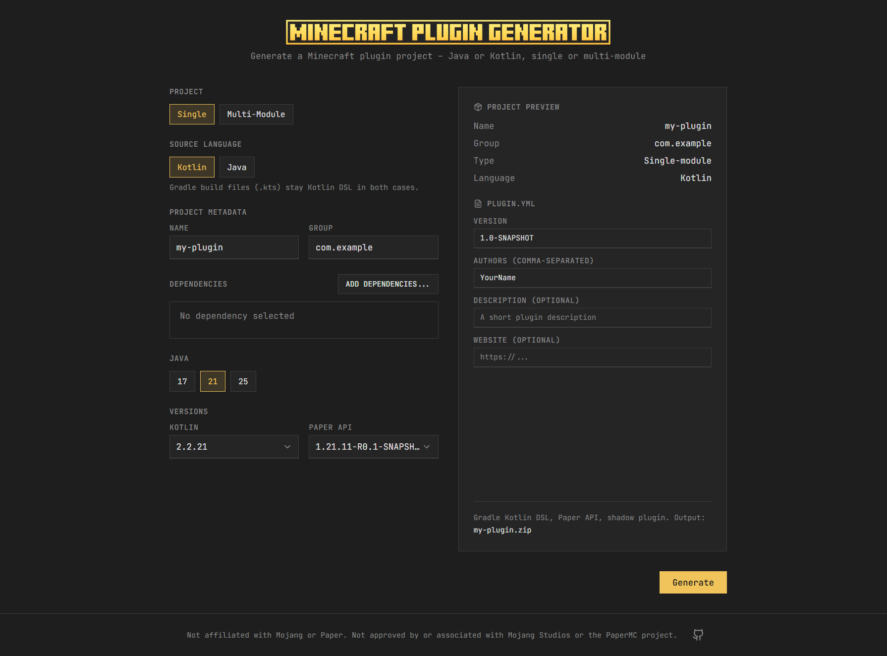

# Minecraft Plugin Template Generator

A wizard (similar to [start.spring.io](https://start.spring.io)) to generate Minecraft plugin projects – Paper, Velocity (planned), Java or Kotlin, single or multi-module.



## Quick Start

```bash
cd web
npm install
npm run dev
```

Open http://localhost:3000 and configure your project. Click "Generate" to download the ZIP.

**Production:** [wizard.developertobi.net](https://wizard.developertobi.net)

## Structure

- **template/** – Template files with placeholders
  - `single/` – Single-module project
  - `multi/` – Multi-module project (API + Plugin)
- **web/** – Next.js app (shadcn)
  - Form to configure project
  - Client-side ZIP generation with JSZip

## Updating Templates

After editing files in `template/`, regenerate the embedded templates:

```bash
cd web
npm run generate-templates
```

Or run `npm run dev` / `npm run build` – they run the generator automatically.

## Build for Production

```bash
cd web
npm run build
npm run start
```

## Docker Deployment (wie HyLib-webui)

### GitHub Actions (CI/CD)

- Push auf `production`-Branch → automatischer Build & Push nach `ghcr.io`
- Image: `ghcr.io/<owner>/minecraft-projekt-wirard:latest`

### Server-Setup

```bash
cd deploy
./setup-server.sh
# .env anpassen falls nötig (DOMAIN)
docker compose up -d
```

Oder manuell: `docker-compose.yml` und `Caddyfile` aus `deploy/` kopieren, `.env` mit `DOMAIN=wizard.developertobi.net` anlegen, dann `docker compose up -d`.

**Voraussetzung:** DNS für die Domain muss auf die Server-IP zeigen. Caddy holt automatisch ein Let's-Encrypt-Zertifikat.
